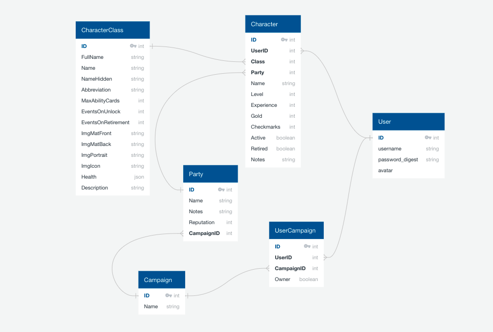
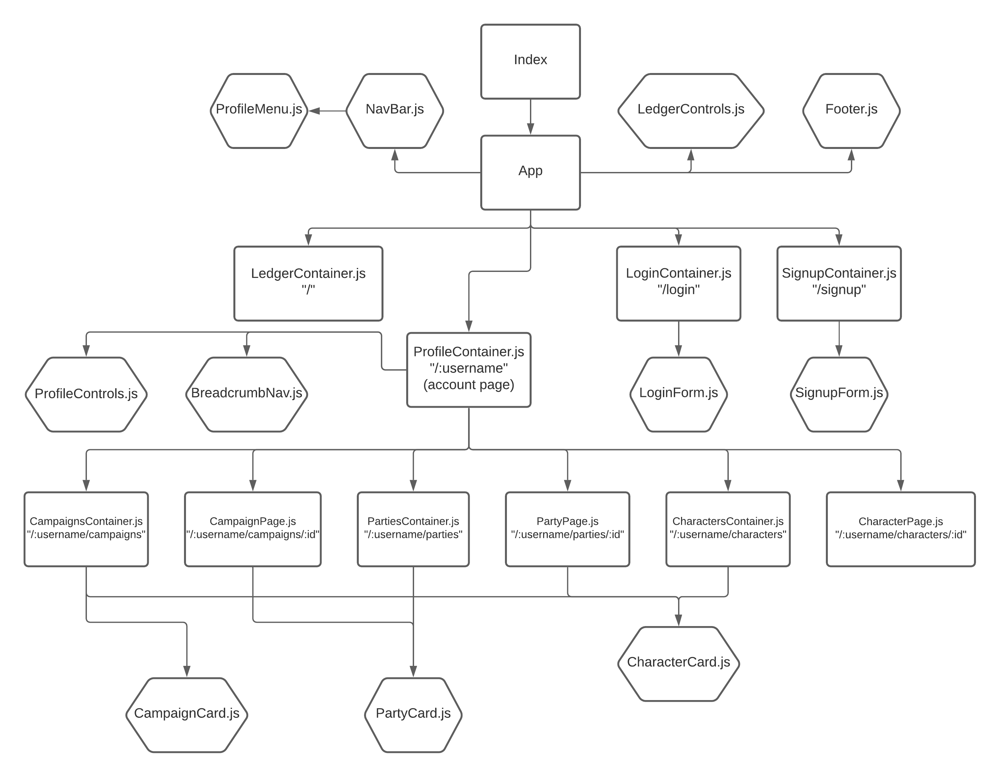
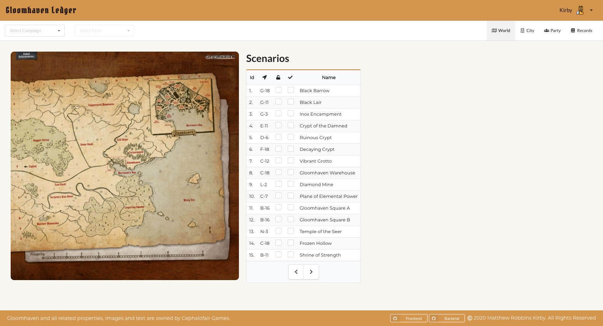
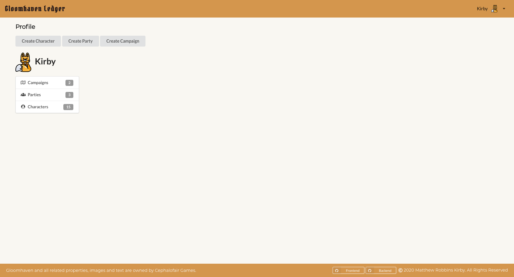
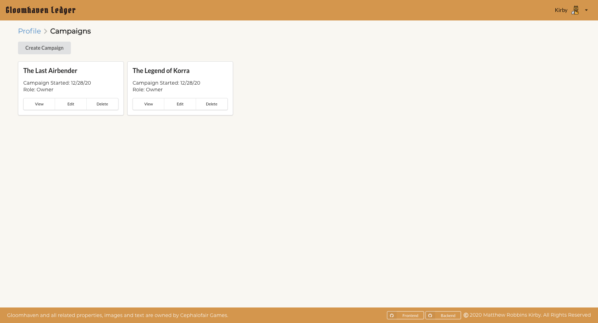
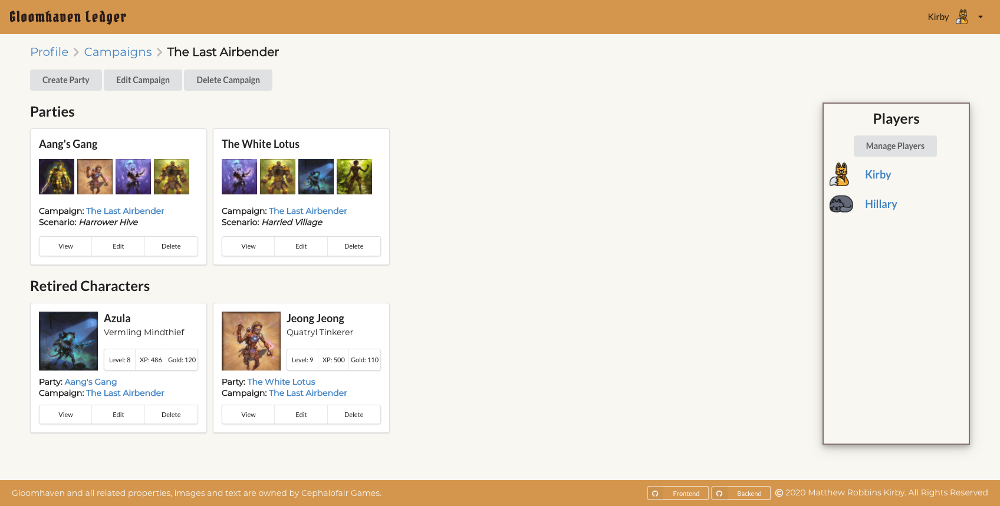
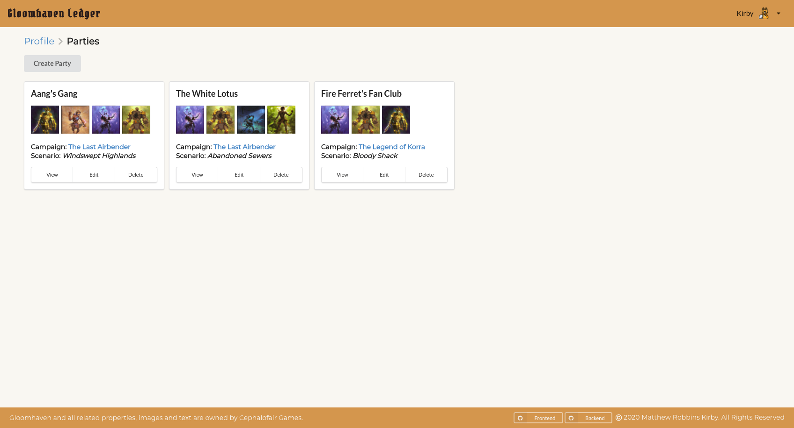
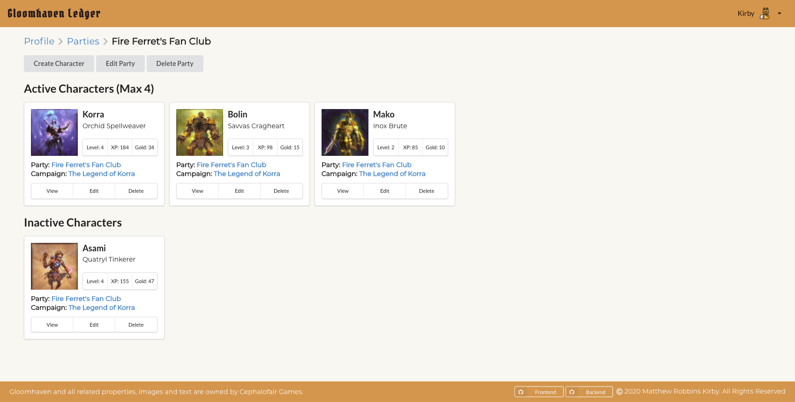
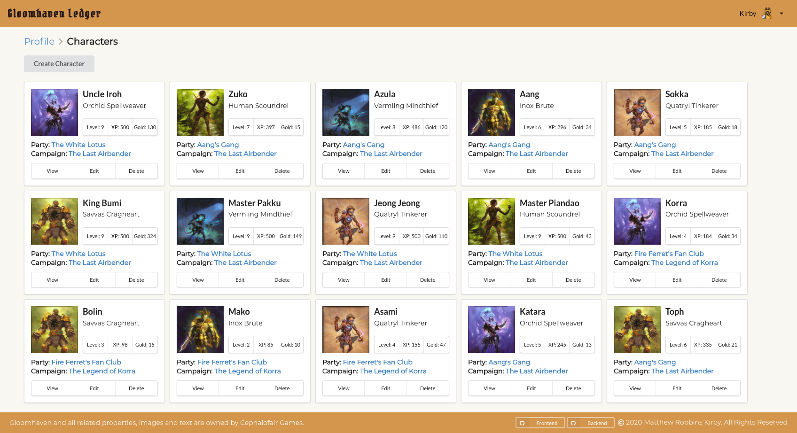
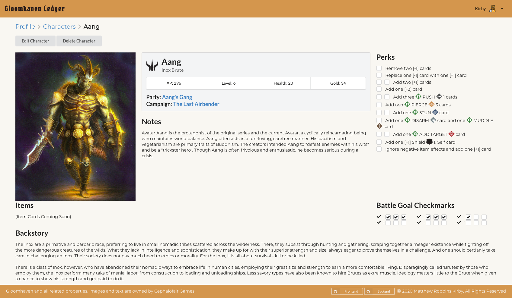

# Gloomhaven Ledger

A digital character creation app for the board game Gloomhaven to streamline the campaign setup process and get players into the game without delay.

- Conceptualized the domain model, component hierarchy, and wireframe design of the application prior to coding.
- Optimized a Rails RESTful API backend with active model serializers to return digital game data and assets.
- Designed a user interface implementing React and Redux with Semantic UI React for styling.

### Ruby on Rails Backend:[ Repo](https://github.com/mkirby/Gloomhaven-Ledger-Backend)

### React Frontend: [ Repo](https://github.com/mkirby/Gloomhaven-Ledger-Frontend)

### Demo Video

### Technologies

- [React](https://github.com/facebook/react)
- [React Redux](https://github.com/reduxjs/react-redux)
- [Redux Thunk](https://github.com/reduxjs/redux-thunk)
- [Semantic UI React](https://github.com/Semantic-Org/Semantic-UI-React)

### Packages

- [React Toast Notifications](https://github.com/jossmac/react-toast-notifications)
- [Date Format](https://github.com/felixge/node-dateformat)
- [react-zoom-pan-pinch](https://github.com/prc5/react-zoom-pan-pinch)

### Domain Model

### Component Hierarchy

### Home Page

### User Profile

### Campaigns Overview

### Campaign Details

### Parties Overview

### Party Details

### Characters Overview

### Character Details

### Acknowledgements

A big thanks to Jason Watmore and the article he wrote about a User Registration and Login example. I spent countless hours working with this example and it really deepened my understanding of a login and user registration flow. <3

- https://jasonwatmore.com/post/2017/09/16/react-redux-user-registration-and-login-tutorial-example#user-actions-js

A big thanks to Matty Williams who's article with a breadcrumb example helped me better understand route and breadcrumbs!

- https://medium.com/@mattywilliams/generating-an-automatic-breadcrumb-in-react-router-fed01af1fc3

Gloomhaven images and assets have been graciously provided by Cephalofair Games and organized by William Habush through [Any2Cards - Gloomhaven](https://github.com/any2cards/gloomhaven) with which I could not have created this project without.
